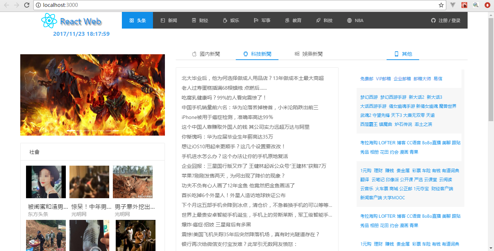

此项目使用**脚手架工具**： [Create React App](https://github.com/facebookincubator/create-react-app).


## 项目技术栈
> React + React-router v4 + Es6 + Axios + Webpack

### 下载项目
``` bash
> git clone https://github.com/hanyucd/news_react.git
```

### 安装依赖
``` bash
> cd news_react
> npm install
```

### 运行项目
``` bash
> npm start
```

### 效果图：
> PC 端



> 移动端


